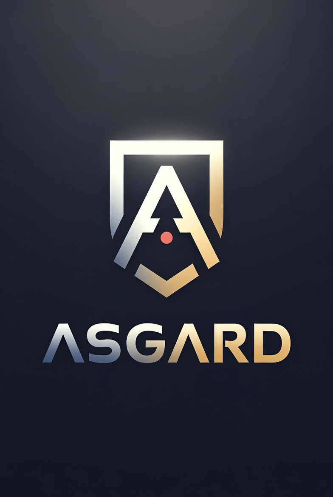

# Asgard

<table>
<tr>
<td width="40%" align="center" valign="top">
<br>
<em>"Loki collects the tricks.<br>Thor of Asgard runs them."</em>
</td>
<td width="60%" valign="top">
<strong>Key Features</strong>
<ul>
<li><strong>Thor-Powered CLI</strong> — every Thor DSL feature available inside <code>.loki</code> task files</li>
<li><strong>Task Dependencies</strong> — sequential, parallel, and mixed dependency graphs via <code>depends_on</code></li>
<li><strong>Concurrent Execution</strong> — parallel task groups run in native Ruby threads</li>
<li><strong>Subcommands</strong> — group related tasks under a named namespace</li>
<li><strong>Variables</strong> — static values and lazy-evaluated lambdas via <code>var</code></li>
<li><strong>Shell Helpers</strong> — <code>sh</code> for any shell command or heredoc; <code>shebang</code> for polyglot scripts</li>
<li><strong>Dotenv Support</strong> — load <code>.env</code> files into the environment with <code>dotenv</code></li>
<li><strong>Auto-Discovery</strong> — <code>.loki</code> root marker searched from CWD upward through parent directories</li>
<li><strong>Multi-File Tasks</strong> — split tasks across <code>*.loki</code> files, loaded on demand with <code>--auto-load</code></li>
<li><strong>Built-in Flags</strong> — <code>--version</code>, <code>--debug</code>, and <code>--verbose</code> available on every task</li>
</ul>
</td>
</tr>
</table>

Asgard is a [Thor](https://github.com/rails/thor)-based task runner for Ruby projects. Define tasks in `.loki` files, declare dependencies between them, and let Asgard handle ordering and concurrent execution. Anything Thor can do — subcommands, typed options, argument validation — is available inside a `.loki` file.

---

## Quick Start

```bash
# Install
gem install asgard

# Create your project root marker
touch .loki

# Add your first task
cat >> .loki << 'EOF'
class Tasks
  desc "hello", "Say hello"
  def hello = sh 'echo "Hello from Asgard!"'
end
EOF

# Run it
asgard hello
```

---

## How It Works

Asgard searches upward from your current directory for a `.loki` file. That file marks the project root. Additional `*.loki` files in the same directory can be loaded by passing `--auto-load` to the `asgard` command. All task files reopen `class Tasks`, which is pre-defined by the gem as a subclass of `Asgard::Base` (itself a Thor subclass).

The full Thor DSL is available: `desc`, `method_option`, `class_option`, `long_desc`, `argument`, `default_task`, `map`, and `subcommand` all work exactly as documented in Thor — with Asgard's own `depends_on`, `var`, `sh`, `shebang`, and `dotenv` layered on top.

---

## Documentation

| Section | Description |
|---|---|
| [Getting Started](getting-started.md) | Install, create your first `.loki`, run your first task |
| [Defining Tasks](tasks.md) | Parameters, options, long_desc, aliases, default_task |
| [Dependencies](dependencies.md) | Sequential, parallel, and mixed dependency graphs |
| [Variables](variables.md) | Static and lazy-evaluated task variables |
| [Helper Methods](helpers.md) | Private helpers and the `no_commands` block |
| [Options & Flags](options.md) | class_option, built-in flags, debug? and verbose? |
| [Subcommands](subcommands.md) | Grouping tasks under a namespace |
| [Shell Helpers](shell.md) | `sh`, `shebang`, and supported interpreters |
| [Environment](environment.md) | Loading `.env` files with `dotenv` |
| [Task Files](task-files.md) | `.loki` root marker, `--auto-load`, multi-file layout |
| [API Reference](api.md) | Module methods, DSL methods, error classes |
| [Examples](examples.md) | Working `.loki` files for every feature |
| [Changelog](changelog.md) | Release history |

---

## Requirements

- Ruby >= 3.2.0
- Dependencies: [thor](https://github.com/rails/thor) `~> 1.0`, [dagwood](https://rubygems.org/gems/dagwood) `~> 1.0`, [dotenv](https://github.com/bkeepers/dotenv) `~> 3.0`
